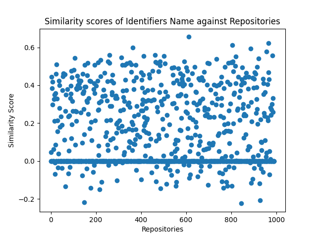

# Python-Identifiers
This is my first attempt to carry out the empirical study on python identifiers. I wanted to know how the identifiers name are used in the python code. What are the different lenghts of identifiers name used in python code? Is there any relevence between the repository name and the identifiers name used inside the repository? By the end of the work I wanted to have a dataset of python identifiers name which can be used by other researcher.

# Research Questions
The some of the research questions that I wanted to address are as follows:

***RQ1)** How well does my system download the relevant project from the github repository?*

***RQ2)** To what degree different length identifier names are used in python source code?*

***RQ3)** Is there any relevance between the identifier name used and the name of the python project repository in the github?*

# Technical Work Flow
## Dependencies Installation
I have used spiral and spacy python3 package for my work. I have also used matplotlip and numpy for graphical representation of data.

### 1. Spiral
I have used spiral package for splitting the identifiers name
It can be access from the github repository called [spiral](https://github.com/casics/spiral).

#### The quick installtion are as follows
<pre>
git clone https://github.com/casics/spiral.git
cd spiral
sudo python3 -m pip install .
</pre>

### 2. Spacy
I have used spacy package for computing the similarity between the two list of texts. 
The builtin model I have used from the spacy package is called **en_core_web_lg**.
The some of other prebuilt models are as follows:
* *en_core_web_sm*
* *en_core_web_md*

The more documentaton on spacy can be found at [spacy website](https://spacy.io/models)
#### The quick installtion are as follows
<pre>
pip3 install spacy
python3 -m spacy download en_core_web_lg
</pre>

### 3. Matplotlib and Numpy
I have used scatter plot and bar graph to represent the data of similarity score and identifiers name length respectively.
#### The quick installtion are as follows
<pre>
pip3 install matplotlib
pip3 install numpy
</pre>

## Repository Structure
<pre>
+ dataset
  - data_scrap_url.csv
  - pythoncodepath.json
  - rawIdentifiersNames.json
  - atomicIdentifiersName.json
  - identifiersName.json
  - identifiersNameFrequency.json
  - repoSimilarityDetails.json
+ image
  - contains the images used to write report
+ repo
  - contains 1000 repos
- python scripts files
</pre>

## How to reprodude same work in your machine?
I have extracted dataset by python scripts so to reproduce same work you can follow the steps given below.

### Step 1
First clone the github repository in your machine or you can download only the python scripts file from my the repository.
<pre>
git clone https://github.com/sumukus/Python-Identifiers.git
</pre>
Navigate inside Python-Identifiers directory, remove all the files inside the repo and dataset directory

### Step 2
 Now run the following python code file in the sequence given below.
<pre>
python3 download_repository.py
python3 pythoncodepath.py
python3 identifier_extract.py
python3 identifiers_name_frequency.py
python3 extract_atomic_identifiers.py
python3 identifiers_names.py
</pre>

After successfully running the above code you should be able to see all the dataset files as given in repo structure section.

***Note:** The identifier_extract.py program can take couple of hours to complete and extract_atomic_identifiers.py can take couple of days to complete running*

### Step 3
In order to view the result diagramatically, run the follwing python code file.
<pre>
python3 data_visualization.py
</pre>

# Results for Research Questions
## RQ1 Result
My python scripts could download 1000 repositories successfully from github. I used the language parameter from github api to download only the python related repositories. In order to get good repositories I used the star received by the repository. So I was able to download top 1000 repositories based on the star count.

## RQ2 Result
The length of python identifiers used in code ranges from 1 to 196. It is based on the identifiers name used in 1000 repositories that I have downloaded. The detailed distribution of data in range is given below in the table.
| Identifier Name Lenght|Identifiers Count|
------------------------|-----------------|
0 - 10  | 49,497,232 |
11 - 20 | 10,854,565 |
21 - 30 | 1,406,668  |
31 - 40 | 224,198    |
41 - 50 | 53,315     |
51 - 60 | 15,665     |
61 - 70 | 4,701      |
71 - 80 | 1,355      |
81 - 90 | 544        |
91 < above | 516     |

### The some of the inferences that we can take from the table
* The most used identifier names are from the name length range 1 to 10 which consist of 79.76% of the identifiers names.
* The least identifier's used are from the name length range of 31 and above which consist almost 0% to the identifier's name.
* The identifiers name length which consist of 17.49% are moderately used from the range 11 to 20.
* The most used identifiers key length is 4 and its count value is 12,015,024.

## RQ3 Result

The y-axis represents the similarity score between the repository name and identifiers name used in it from -1 to +1. The x-axis represents the repositories. Since the name is not important in the graph, I have represented them using an index as it appears on the json file. The negative value represents the strong dissimilarity between the python repository name and the identifiers used in it. The positive value represents the similarity between the python repository name and identifiers name used in it. Greater the positive value, more the similarity between the repository name and identifiers name used in the python program code. If the similarity score value is +1 then it indicates that the repository name is extensively used in python code as identifiers names.

From the scatter plot given below I can conclude that there is no relationship for most of the repositories name used and identifiers name used in it. At maximum it has a similarity score of 65.58% for “dev-setup” repository and the worst score is of -22.42 for the “thefuck” repository.

